# Lab 27.2.14 – Extracting an Executable from a PCAP

## Cisco CyberOps Associate

---

## Overview

This lab demonstrates how to perform packet-level network forensic analysis in order to reconstruct and extract an executable file from a captured PCAP file.

The objective was to:

* Understand how file downloads occur over HTTP
* Analyze TCP session establishment
* Reconstruct full TCP streams
* Recover transferred files directly from packet captures
* Validate the true identity of a downloaded file

The analysis was performed using the CyberOps Workstation virtual machine and Wireshark.

---

## Part 1 – Traffic Analysis

The file `nimda.download.pcap` was opened in Wireshark for inspection.

### TCP & HTTP Inspection

Initial packet review revealed:

* The first three packets corresponded to the TCP three-way handshake
* The fourth packet contained an HTTP GET request targeting:

```
W32.Nimda.Amm.exe
```

This confirmed that the client initiated a file download over HTTP.

Using **Follow TCP Stream**, the complete communication between client and server was reconstructed.

---

### Binary Stream Analysis

Within the TCP stream:

* Non-readable characters appeared due to the binary nature of the transferred file
* These symbols represent raw executable data, not malformed traffic
* Several readable strings were embedded within the binary content

Upon reviewing the extracted strings, the executable was identified as:

**Microsoft Windows Command Processor (cmd.exe)**

Despite being named `W32.Nimda.Amm.exe`, analysis revealed that the file was actually the legitimate Windows `cmd.exe` executable that had been renamed.

This highlights a common **masquerading technique**, where a legitimate file is renamed to resemble malware.

---

## Part 2 – File Extraction

Using:

```
File → Export Objects → HTTP
```

Wireshark displayed the HTTP objects transmitted within the session.

Only one file was present in the capture because:

* The recording started immediately before the download
* The capture stopped immediately after the transfer completed

The file was exported and saved to:

```
/home/analyst
```

---

## File Verification

File presence was confirmed using:

```bash
ls -l
```

The extracted file size was:

```
345,088 bytes
```

To determine the file type:

```bash
file W32.Nimda.Amm.exe
```

Output:

```
PE32+ executable (console) x86-64, for MS Windows
```

This confirmed that the recovered object was a valid Windows Portable Executable (PE) file.

---

## Key Takeaways

In this lab, I successfully:

* Analyzed TCP handshake mechanics
* Inspected HTTP file transfer traffic
* Reconstructed a complete TCP session
* Extracted an executable directly from a PCAP
* Verified the true identity of the downloaded file

This exercise demonstrates how network forensic analysis enables analysts to recover transferred artifacts and validate file authenticity beyond filenames alone.

---

## Steps

<p align="center">
  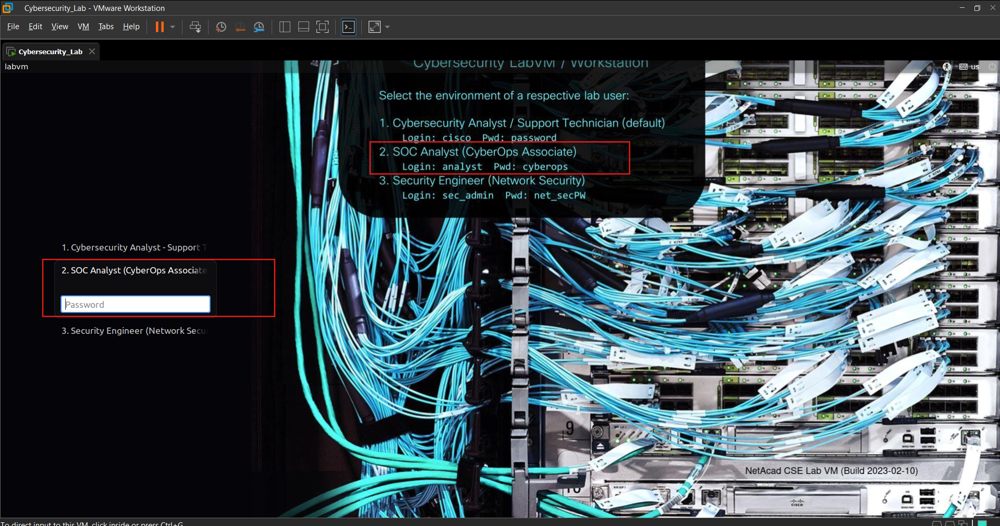<br><br>
  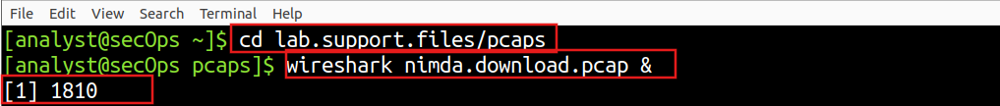<br><br>
  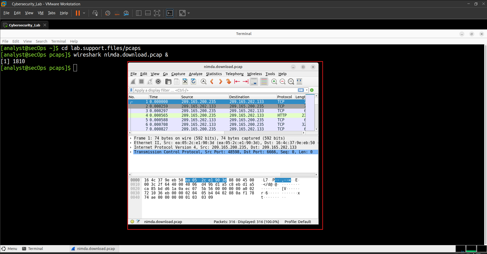<br><br>
  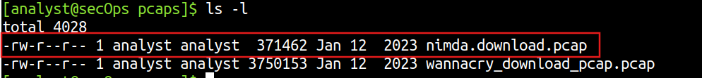<br><br>
  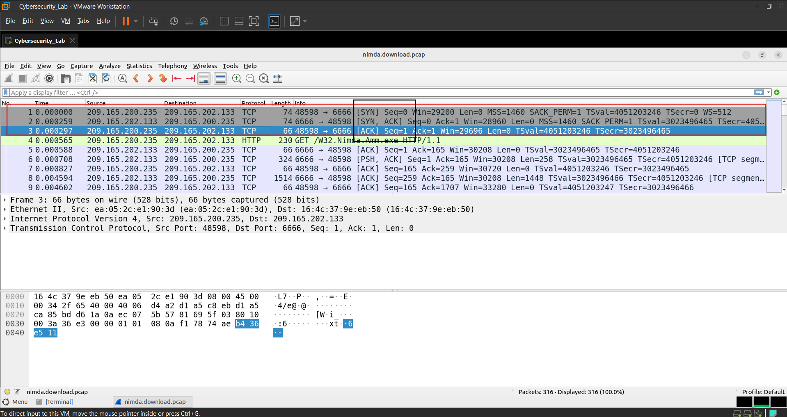<br><br>
  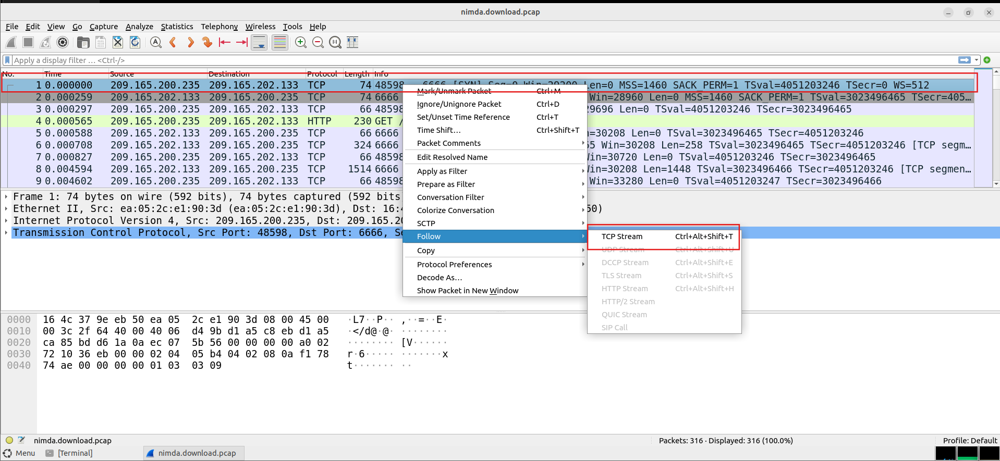<br><br>
  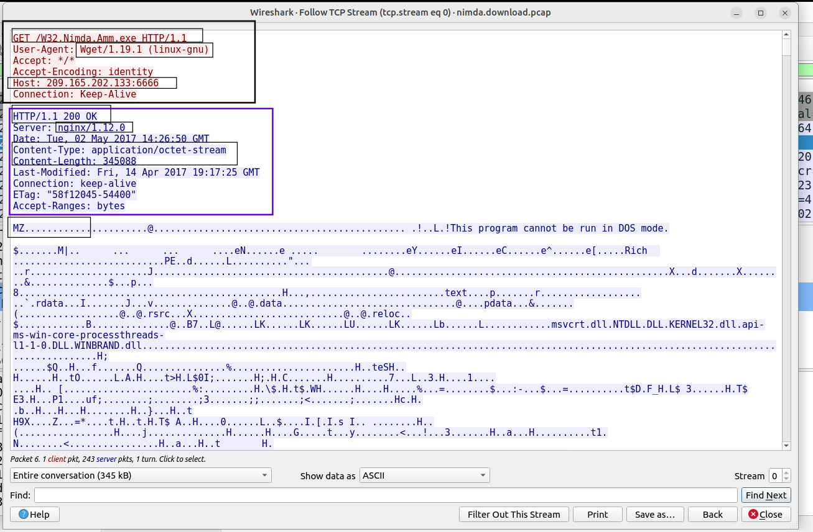<br><br>
  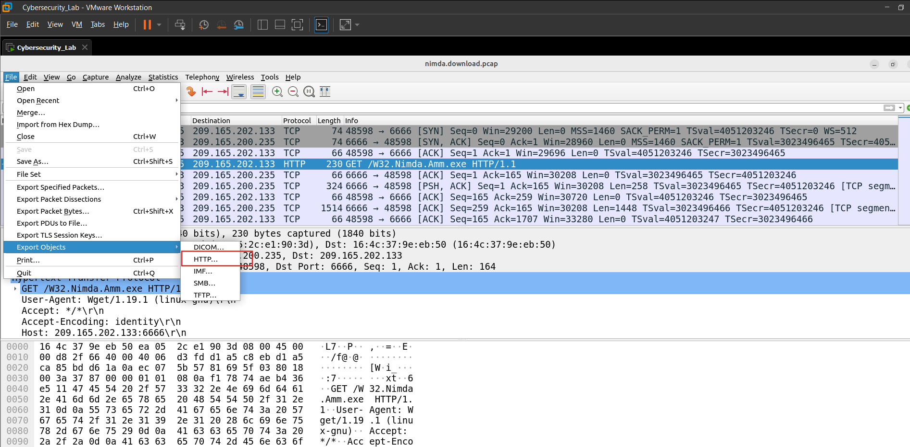<br><br>
  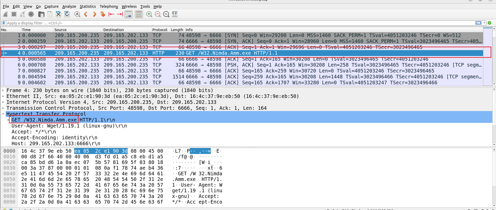<br><br>
  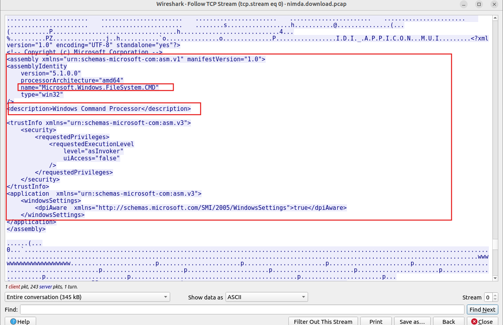<br><br>
  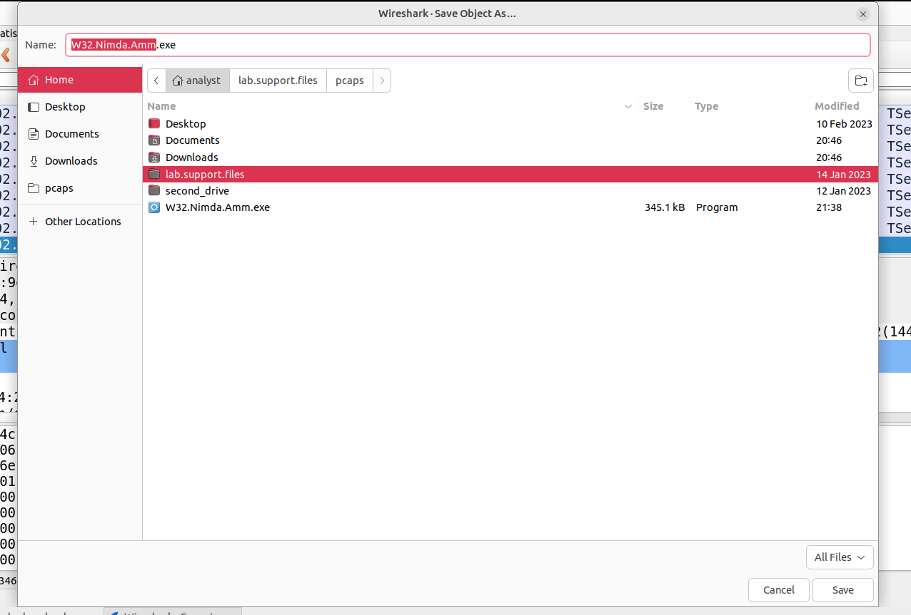<br><br>
  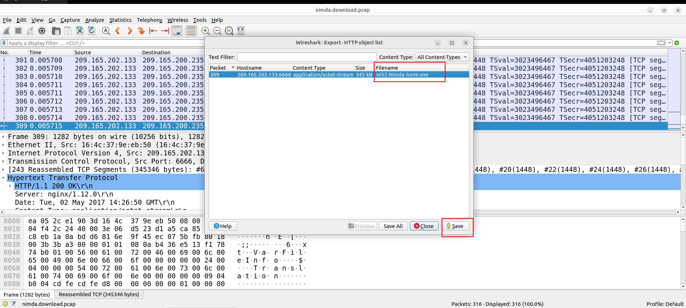<br><br>
  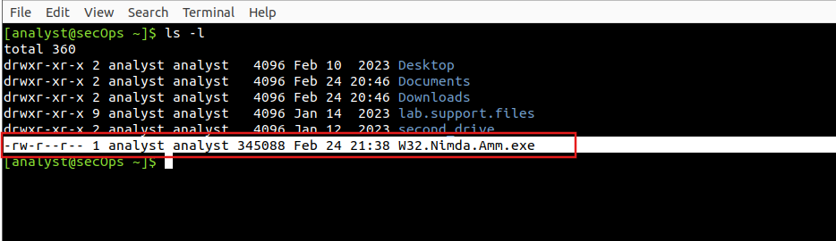<br><br>
  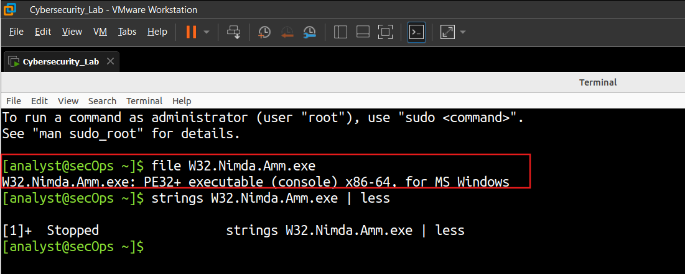<br><br>
  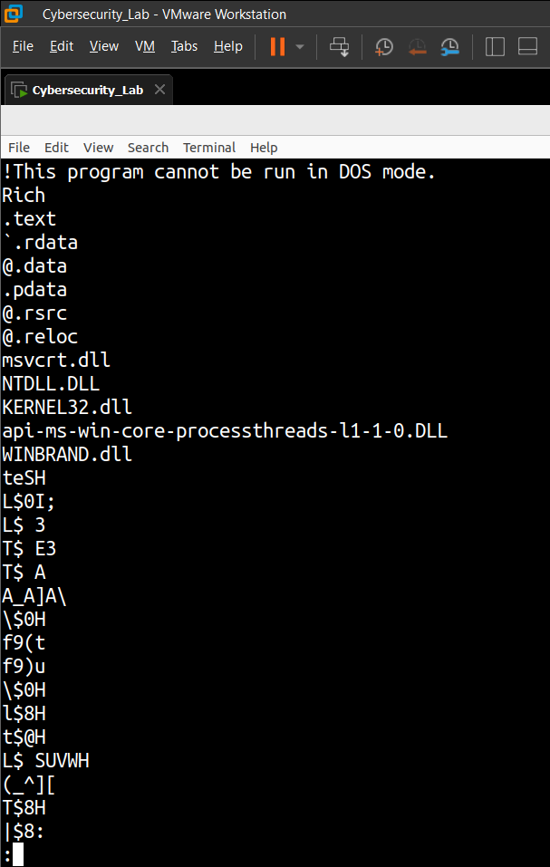
</p>

---
